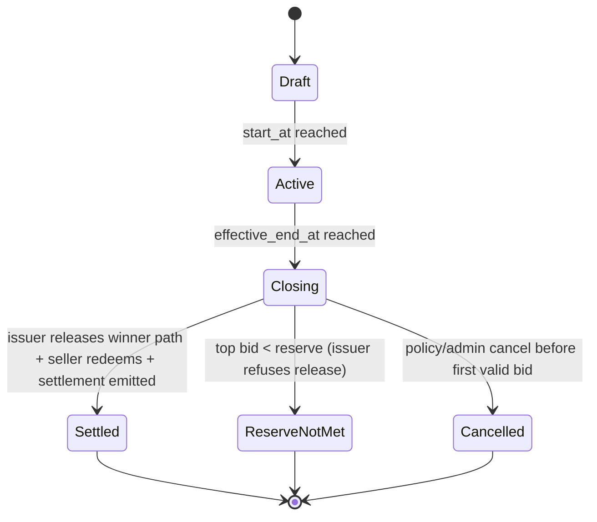
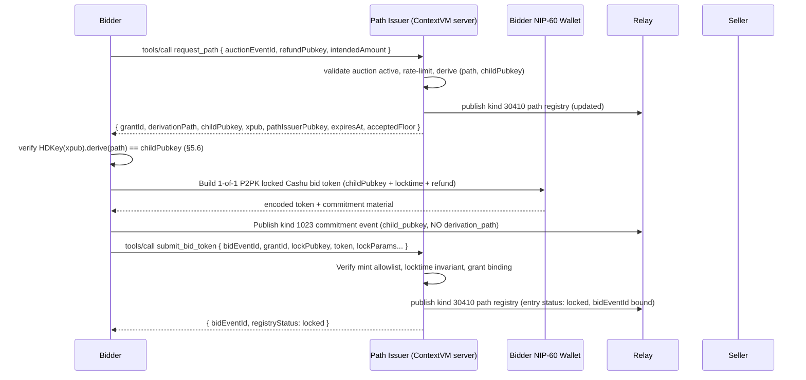
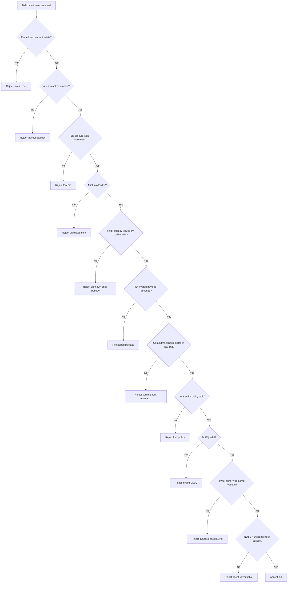

# AUCTIONS CODEX (Draft)

## 1. Purpose

This document proposes an auctions scheme for the market protocol using Nostr
events plus Cashu as an enforceable bearer-asset bid mechanism.

Goal for v1:

- Standard timed auction (English, ascending, highest bid wins).
- Bid is only valid if backed by actual locked Cashu value (vadium/deposit).
- Non-winning bidders can recover funds.
- Seller defines trusted mints.
- Seller cannot unilaterally redeem bids before settlement.
- App/service never holds Cashu key material — it gates settlement through
  information release, not signatures.
- Design remains extensible for additional auction types later.

---

## 2. Scope and Principles

### In scope (v1)

- Limited-time auctions.
- Open bidding.
- Full amount bid-backed deposit (100% vadium by default).
- Cashu **1-of-1 P2PK lock with refund timelock** (NUT-10/NUT-11) on an
  app-issued HD-derived seller child pubkey.
- **Path-oracle** pattern: a designated path issuer (the app) assigns the
  derivation path that produces each bid's lock pubkey, and only reveals
  that path to the seller at authorised settlement time.
- Relay-visible public bid commitment + private token envelope.

### Out of scope (v1)

- On-chain escrow.
- Cashu 2-of-2 / n-of-m multisig lock profiles.
- Complex dispute arbitration.
- Sealed-bid reveal rounds.
- Partial deposit modes (except as a forward-compatible field).

### Security principles

- No informal bids: every valid bid must include spendable value commitment.
- No cleartext token leakage on public relays.
- Mint trust is explicit and seller-controlled.
- Auction closing must be deterministic from immutable root data.
- **No single party controls bid funds.** The seller alone cannot derive the
  child private key for any specific locked bid because the derivation path
  is an app-held secret. The app alone cannot spend because it holds no
  xpriv-derived material. Together they must cooperate — or, after the
  locktime, the bidder unilaterally reclaims.
- **Safe failure mode.** If the path-oracle state is lost or the issuer goes
  offline, no funds can be stolen; all bids simply refund at locktime.

---

## 3. Source Inputs

- Existing marketplace draft spec conventions in `gamma_spec.md` and `SPEC.md`.
- Cashu primitives:
  - NUT-10 (well-known secrets).
  - NUT-11 (P2PK locks, locktime, refund).
  - NUT-14 (HTLC, future extension).
- Local app context:
  - Existing NIP-60 wallet support.
  - Existing ecash flow and trusted mint handling.
- Inspiration: ecash-with-derivation-paths pattern demonstrated at
  `https://github.com/gzuuus/cba`.

---

## 4. Auction Event Model

Kind values below are proposal values for discussion before final NIP/spec
assignment.

## 4.1 Kind `30408` Auction Listing (Addressable, updatable)

Signed by seller.

Auction listings are **self-describing**: they carry the same product-shaped
metadata as a kind `30402` product listing (see `gamma_spec.md` §3 for field
semantics), plus auction-specific bidding, timing, and settlement tags.
There is intentionally no product reference (`a` tag) in v1.

### Required tags

- `d`: auction identifier.
- `title`: display title.
- `auction_type`: `english` (v1 required).
- `start_at`: unix seconds.
- `end_at`: unix seconds.
- `currency`: `SAT` (v1 required).
- `reserve`: minimum acceptable final price (may be `0`, but tag required in
  v1 for explicitness).
- `bid_increment`: minimum step in sats.
- `mint`: trusted mint URL. MAY repeat.
- `settlement_policy`: `cashu_p2pk_path_oracle_v1`.
- `key_scheme`: `hd_p2pk`.
- `p2pk_xpub`: seller HD xpub used for per-bid seller child key derivation.
- `max_end_at`: **hard bidding cutoff** in unix seconds. The second of the
  three protocol timestamps (see §6.0). Either equals `end_at` (no
  anti-snipe window) or sits later — `max_end_at = end_at + window` where
  `window` is the seller-chosen anti-snipe window (typically minutes).
  Bids submitted in `[start_at, end_at]` pay the flat floor; bids in
  `(end_at, max_end_at]` pay the curve floor (see `min_bid_curve` below).
  Always required so the Cashu locktime is computable from auction tags
  alone.
- `settlement_grace`: seconds between `max_end_at` and the bid's Cashu
  locktime — i.e. the window in which the seller has to publish the
  settlement after bidding closes. Together with `max_end_at` this fully
  determines `T_unlock` (see §6.0):
  `locktime = max_end_at + settlement_grace`. v1 form presets: `300`
  (5 min), `3600` (1 h), `10800` (3 h). Auctions MAY use shorter values
  (e.g. `30` for dev quick-settle test fixtures); production
  deployments SHOULD use values comfortably above the worst-case time
  required to fetch a path release, derive child privkeys, swap each
  leg at the mint, and publish the kind-1024 event.
- `min_bid_curve`: anti-snipe floor curve applied in `(end_at, max_end_at]`.
  Format `<shape>:<peak_multiplier>` where `shape ∈ {none, linear,
exponential}` and `peak_multiplier` is a decimal in `[1.0, 100.0]`.
  Floor computed as `baseline × multiplier(t)`:
  - `baseline = top_bid === 0 ? starting_bid : top_bid + bid_increment`
  - `multiplier(t) = 1` when `t ≤ end_at` or `shape = none`
  - `multiplier(t) = peak_multiplier` when `t ≥ max_end_at`
  - In `(end_at, max_end_at)` with `t_norm = (t - end_at) / (max_end_at - end_at)`:
    - `shape = linear` → `1 + (peak_multiplier - 1) × t_norm`
    - `shape = exponential` → `peak_multiplier ^ t_norm`
      v1 form presets for `peak_multiplier`: `2.0` / `5.0` / `10.0`. Default
      when tag is missing: `none:1.0` (no curve, flat floor through the
      whole bidding window). The path issuer enforces this floor at
      `request_path` time and re-checks at settlement per-bid.

### Optional auction tags

- `vadium_ratio_bps`: default `10000` (100%).
- `schema`: version marker, e.g. `auction_v1`.
- `path_issuer`: Nostr pubkey of the path oracle (defaults to the app's
  published oracle pubkey when omitted). OPTIONAL. When present, the bidder
  MUST route the pre-bid path request to this pubkey; when absent, the
  bidder uses the app default.

### Removed from prior drafts (v0 / `cashu_p2pk_2of2_v1`)

- `escrow_pubkey` — the path-oracle profile has no Cashu cosigner. Bid
  proofs lock to a single child pubkey (1-of-1). Implementations MUST NOT
  emit `escrow_pubkey` with `settlement_policy=cashu_p2pk_path_oracle_v1`.
- `escrow_identity` — replaced by `path_issuer`. Legacy readers SHOULD treat
  `escrow_identity` on a path-oracle auction as equivalent to `path_issuer`
  if the latter is absent.

### Optional product-shaped tags

These tags carry the same semantics as on kind `30402` product listings.
See `gamma_spec.md` §3 for full field definitions.

- `summary`, `image`, `spec`, `t`, `content-warning`, `shipping_option`,
  `weight`, `dim`, `location`, `g`.

### Immutable vs mutable tags

Immutable after first publish:

- `auction_type`
- `start_at`
- `end_at`
- `currency`
- `mint` set
- `p2pk_xpub`
- `path_issuer`
- `max_end_at`
- `settlement_grace`
- `min_bid_curve`
- `settlement_policy`
- `key_scheme`
- `reserve`
- `bid_increment`

`extension_rule` was used in earlier drafts (v0) to describe a dynamic
`end_at`-shifting anti-snipe scheme. v1 retires it: the curve in
`min_bid_curve` replaces it, and `max_end_at` is now fixed at publish
time. Implementations MAY emit `['extension_rule', 'none']` for
backwards compatibility, but any non-`none` value MUST be ignored.

Mutable:

- `title`
- `content` (description)
- media/display metadata

Important:

- Because this is addressable+updatable, clients and platform MUST pin and
  store the first event ID (`auction_root_event_id`).
- Bids MUST reference `auction_root_event_id`, not only `a` coordinate.
- Updates changing immutable fields MUST be rejected by clients/indexers.

### Example

```jsonc
{
	"kind": 30408,
	"content": "Vintage camera, tested, ships worldwide",
	"tags": [
		["d", "auction-7f0b9a"],
		["title", "Vintage Camera Auction"],
		["summary", "Leica M3 in collector-grade condition"],
		["auction_type", "english"],
		["start_at", "1766202000"],
		["end_at", "1766288400"],
		["max_end_at", "1766289000"], // end_at + 600s anti-snipe window
		["settlement_grace", "3600"], // 1 h seller-settlement window
		["min_bid_curve", "exponential:5.0"], // 5× floor at max_end_at
		["currency", "SAT"],
		["reserve", "50000"],
		["bid_increment", "1000"],
		["mint", "https://mint.minibits.cash/Bitcoin"],
		["mint", "https://mint.coinos.io"],
		["settlement_policy", "cashu_p2pk_path_oracle_v1"],
		["key_scheme", "hd_p2pk"],
		["p2pk_xpub", "xpub6Bk...sellerAuctionXpub"],
		["path_issuer", "<app-path-oracle-nostr-pubkey>"],
		["schema", "auction_v1"],

		// Product-shaped fields
		["image", "https://cdn.example/m3-front.jpg", "1200x800", "0"],
		["spec", "Brand", "Leica"],
		["t", "cameras"],
		["shipping_option", "30406:<seller-pubkey>:standard-intl", "2500"],
	],
}
```

## 4.2 Kind `1023` Auction Bid Commitment (regular event)

Signed by bidder. Public event carries commitment and metadata, not raw
token, and — critically — **not the derivation path**.

### Required tags

- `e`: `<auction_root_event_id>`
- `a`: auction coordinate `30408:<seller_pubkey>:<d-tag>`
- `p`: `<seller_pubkey>`
- `amount`: bid amount in sats.
- `currency`: `SAT`
- `mint`: mint URL for locked token.
- `commitment`: hash commitment over private payload (including token).
- `locktime`: unix seconds used in lock script.
- `refund_pubkey`: bidder refund pubkey (compressed secp256k1 hex).
- `child_pubkey`: HD-derived child pubkey actually used in lock (compressed
  secp256k1 hex). REQUIRED under `key_scheme=hd_p2pk`.
- `created_for_end_at`: copied auction end timestamp to bind client intent.
- `bid_nonce`: random id per bid.
- `key_scheme`: MUST match the auction `key_scheme`.
- `status`: `locked` at publish time.

### Optional tags

- `prev_bid`: previous bid event id from same bidder (replacement chain).
- `path_issuer`: Nostr pubkey of the issuer that granted the path used for
  this bid. OPTIONAL. When present, MUST match the auction's `path_issuer`.
  Clients MAY omit this when the issuer is understood by context.
- `path_grant_id`: OPTIONAL opaque identifier echoing the
  `AuctionPathGrant` envelope id (see §7.5) for operational traceability.
- `note`: short human text.

### Forbidden tags

- `derivation_path`: MUST NOT appear on a path-oracle bid. The path is a
  secret held by the path issuer and MUST NOT be published. Bids tagged
  with `derivation_path` under `settlement_policy=cashu_p2pk_path_oracle_v1`
  MUST be rejected by clients.

### Private companion payload (MUST)

Bidder sends encrypted payload to the path issuer via NIP-17 DM (kind
`14`, NIP-44). Topic: `auction_bid_token_v1`.

- `auctionEventId` (root)
- `auctionCoordinates`
- `bidEventId`
- `bidderPubkey`
- `sellerPubkey`
- `pathIssuerPubkey`
- `lockPubkey` (the child pubkey used in the lock; MUST match `child_pubkey`
  tag on the public event)
- `refundPubkey`
- `locktime`
- `mintUrl`
- `amount`
- `totalBidAmount`
- `commitment`
- `bidNonce`
- `token` (encoded Cashu token)

Why split:

- Cashu token is bearer value and MUST NOT be posted in clear in public
  event content.

## 4.3 Kind `1024` Auction Settlement (regular event)

Signed by the seller after the path issuer releases the winning path.

### Required tags

- `e`: `<auction_root_event_id>`
- `a`: auction coordinate.
- `status`: `settled | reserve_not_met | cancelled`
- `close_at`: unix seconds when close was computed.
- `winning_bid`: `<bid_event_id>` or empty if no winner.
- `winner`: `<bidder_pubkey>` or empty.
- `final_amount`: sats (or `0`).

### Optional tags

- `refund`: repeating tags
  `["refund", "<bid_event_id>", "<bidder_pubkey>", "<status>"]`
- `payout`: `["payout", "<winning_bid_event_id>", "<amount>", "redeemed"]`
- `path_release_id`: OPTIONAL opaque identifier echoing the
  `AuctionPathRelease` envelope (see §7.5) so observers can correlate
  settlement with the issuer's approval record.
- `reason`: machine code for cancellation/failure.

## 4.4 Kind `30410` Auction Path Registry (Addressable, app-owned)

NEW — a parameterized replaceable event published by the path issuer
(`path_issuer`), encrypted to the issuer's own pubkey with NIP-44.
Acts as the canonical issuer-side record of which derivation paths have
been allocated to which bids for a given auction.

- `kind`: `30410`
- `d`: `path_oracle:<auction_root_event_id>`
- `content`: NIP-44 encrypted JSON `AuctionPathRegistry` (see below)
- Tags (plaintext):
  - `e`: `<auction_root_event_id>`
  - `a`: auction coordinate
  - `auction_root_event_id`: `<auction_root_event_id>`
  - `path_issuer`: `<issuer_pubkey>`
  - `schema`: `auction_path_registry_v1`

### AuctionPathRegistry (decrypted payload)

```ts
interface AuctionPathRegistry {
	type: 'auction_path_registry_v1'
	auctionEventId: string
	auctionCoordinates: string
	xpub: string
	entries: AuctionPathRegistryEntry[]
	updatedAt: number
}

interface AuctionPathRegistryEntry {
	bidderPubkey: string
	derivationPath: string
	childPubkey: string
	grantId: string
	grantedAt: number
	bidEventId?: string
	status: 'issued' | 'locked' | 'released' | 'refunded' | 'expired'
	releasedAt?: number
	releaseTargetPubkey?: string
}
```

- The registry is authoritative for the issuer. Loss of the registry cannot
  produce fund loss — it only prevents future path releases, in which case
  bids refund at locktime (see §8 / §14).
- Clients other than the issuer SHOULD NOT attempt to consume the
  registry. It is published to Nostr for issuer-side resilience (recovery
  across processes/instances) rather than for public consumption.

## 4.5 Issuer transport: ContextVM tools (CEP-15)

All bidder ↔ issuer and seller ↔ issuer communication runs over
**ContextVM / MCP-over-Nostr** — there is no privileged HTTP API and no
custom NIP-44 DM topic family. The path issuer is published as a
ContextVM server announcing the `english_auction_path_oracle_v1`
**common-schema family** per CEP-15. Clients discover facilitators by
querying for the family's per-tool schema hash (kind 11317 with `#i`).

### Tool family

| Tool name            | Direction       | Purpose                                                                                                                           |
| -------------------- | --------------- | --------------------------------------------------------------------------------------------------------------------------------- |
| `request_path`       | Bidder → Issuer | Request a fresh derivation path before locking. Bidder MUST verify the returned path against the auction `p2pk_xpub` (§5.6).      |
| `submit_bid_token`   | Bidder → Issuer | After publishing the kind-1023 commitment, deliver the locked Cashu token + lock parameters. Issuer advances registry → `locked`. |
| `request_settlement` | Seller → Issuer | Ask for the winning chain's derivation paths + locked tokens. Reserve-not-met returns an empty `releases` array.                  |
| `get_auction_state`  | Anyone → Issuer | Read-only view of phase, current floor, top bid, and registry health. No caller identity required.                                |

Tool input/output schemas live in `contextvm/auction-schemas.ts`. Each
tool's CEP-15 `schemaHash` is computed by the SDK helper
`computeCommonSchemaHash({ name, inputSchema, outputSchema })` after
RFC 8785 (JCS) canonicalization with documentation fields stripped — see
`@contextvm/sdk/core/utils/common-schema.ts`. The schema hash is **part
of the family identity**: bumping any field of any input/output schema
requires a `_v2` tool name.

### Caller identity (§7.5.1)

The MCP transport authenticates the caller. The wrapping kind-25910
(or kind-1059 gift-wrap) is signed by the bidder/seller, and the SDK
injects that pubkey into the inbound message's `_meta` field
(`injectClientPubkey: true`). Tool handlers read `extra._meta.clientPubkey`
to identify the caller — no `bidderPubkey` / `sellerPubkey` field is
accepted in the input schema, which closes the §7.5.1 identity-proof
requirement automatically.

### Discovery (CEP-15)

A facilitator announces its tools via kind 11317 with one `["i", "<schemaHash>", "<toolName>"]`
tag per common-schema tool. A client discovers facilitators implementing
this family by querying `{ kinds: [11317], "#i": ["<request_path schema hash>"] }`,
deduplicating by event author, and presenting the resulting list to
the seller during auction creation. The selected facilitator's pubkey
is recorded in the auction event's `path_issuer` tag.

### Forbidden / removed

- The kind-14 `auction_path_request_v1` / `auction_path_grant_v1` /
  `auction_path_release_v1` / `auction_refund_v1` DM topics MUST NOT be
  used. Any envelope shapes for them in
  `src/lib/auctionTransfers.ts` are vestigial and slated for removal.
- The `/api/auctions/path-request` and `/api/auctions/settlement-plan`
  HTTP endpoints are deprecated; ContextVM is the sole transport.
- `auction_bid_token_v1` is retained only as a transitional shape for
  in-flight migration; under the new transport the token is shipped
  as `submit_bid_token` arguments and is never published as a kind-14
  envelope.

---

## 5. Cashu Locking Profile (v1)

## 5.1 Why lock profile is required

A bid without enforceable value is spam. V1 requires a bid token that is
cryptographically locked with a refund path.

## 5.2 Proposed lock profile: `cashu_p2pk_path_oracle_v1`

Use NUT-11 P2PK secret with:

- **Single** lock pubkey: the HD-derived seller child pubkey assigned to
  this bid by the path issuer. No Cashu cosigner.
- `n_sigs`: omitted (default 1). The lock is 1-of-1.
- `locktime`: `max_end_at + settlement_grace` (the auction's
  `settlement_grace` tag — see §4.1).
- `refund`: bidder refund pubkey.
- `n_sigs_refund=1`.
- `sigflag=SIG_INPUTS` (v1).

`settlement_grace` is per-auction (see §4.1). v1 default: 7200 seconds (2 h).

This yields:

- Seller cannot spend alone **without the derivation path**, which only the
  path issuer holds. The seller may hold the account xpriv, but without the
  path for a specific bid they cannot derive the child privkey (the
  derivation path has approximately 2^155 bits of entropy across five
  non-hardened levels of 31-bit indices — see §5.5).
- App/service cannot spend because it holds no xpriv-derived material — it
  can withhold paths (DoS), but cannot seize funds.
- Reserve, anti-sniping, and immutability become **issuer-enforceable by
  path-release policy**: the issuer simply refuses to release the winning
  path unless the auction rules are satisfied. Every locked bid refunds at
  locktime.
- If the issuer fails/stalls, the bidder reclaims after locktime using the
  refund key.

### Differences from the historical `cashu_p2pk_2of2_v1` profile

- No `escrow_pubkey` in the lock — the NUT-11 `pubkeys` multisig slot is
  empty.
- No `n_sigs` tag — single-sig by default.
- Settlement requires the issuer to release a secret (path), not to
  co-sign a spend.
- Wider mint compatibility: mints that support minimal NUT-11 (P2PK +
  locktime + refund) suffice.

## 5.3 Exact NUT-11 tag layout

The recommended per-bid `Secret` shape is:

```json
[
	"P2PK",
	{
		"nonce": "<random>",
		"data": "<seller_child_pubkey>",
		"tags": [
			["sigflag", "SIG_INPUTS"],
			["locktime", "<locktime_unix_seconds>"],
			["refund", "<bidder_refund_pubkey>"],
			["n_sigs_refund", "1"]
		]
	}
]
```

Interpretation:

- Before `locktime`, only `seller_child_pubkey` can spend (1-of-1).
- After `locktime`, the bidder refund pubkey can additionally spend.
- `SIG_ALL` remains the long-term target (deferred until cashu-ts support
  lands).

## 5.4 cashu-ts shape

```ts
import { P2PKBuilder } from '@cashu/cashu-ts'

const p2pk = new P2PKBuilder()
	.addLockPubkey(sellerChildPubkey) // single pubkey, 1-of-1
	.lockUntil(locktime)
	.addRefundPubkey(bidderRefundPubkey)
	.requireRefundSignatures(1)
	.toOptions()

const { keep, send } = await wallet.ops.send(amount, proofs).asP2PK(p2pk).run()
```

`send` proofs are encoded and delivered only via encrypted channel.

## 5.5 Path oracle model (replaces prior "HD custody" mode)

Instead of the bidder generating a random derivation path and publishing
it, the **path issuer** allocates the path for each bid and keeps it
confidential until authorised release.

Path structure:

- Five non-hardened levels, each a uniformly random index in
  `[0, 0x7fffffff]` (31 bits).
- Total entropy ≈ 155 bits. Brute-forcing the path given only `xpub` and
  `child_pubkey` is computationally infeasible.

Roles:

- **Seller** publishes `p2pk_xpub` and optionally `path_issuer`. Never
  sees any path until release. Holds the xpriv used to derive child
  privkeys from released paths.
- **Path issuer** (the app or a federated oracle): generates paths,
  derives `child_pubkey = HDKey.derive(xpub, path)`, persists the
  mapping, releases paths to the seller only when auction policy is
  satisfied.
- **Bidder**: requests a path from the issuer (§7.5), verifies the
  issuer's claim that `child_pubkey == HDKey.derive(xpub, path)` locally
  (this step is non-negotiable — see §5.6), then locks proofs to that
  `child_pubkey`.

Constraints:

- Non-hardened path levels only — bidders derive from `xpub`.
- Never export child private keys.
- Do not reuse paths across bids (issuer enforces uniqueness per auction).
- Refund+locktime rules unchanged.

Seller UX impact:

- Same as before: enable HD auction keys, publish xpub.
- At settlement, seller receives one path per winning-chain bid from the
  issuer, derives child privkeys locally, redeems.

## 5.6 Bidder-side path verification (normative)

On receipt of a successful `request_path` response, the bidder MUST
verify:

1. The response was returned by the ContextVM server whose pubkey is the
   auction's `path_issuer` (the `NostrClientTransport` was instantiated
   with that `serverPubkey`, and the SDK's correlation store guarantees
   the response originated from it).
2. `response.xpub` matches the auction's `p2pk_xpub`.
3. `HDKey.fromExtendedKey(response.xpub).derive(response.derivationPath).publicKey`
   serialises to exactly `response.childPubkey` (compressed secp256k1
   66-hex form).

If any check fails, the bidder MUST abort and MUST NOT lock funds.
Skipping this verification allows a malicious path issuer to substitute a
pubkey it controls, enabling theft. Implementations that fail to verify
are non-compliant.

---

## 6. Auction State Machine



Deterministic close input set:

- `auction_root_event_id`
- immutable root fields
- all valid bids accepted by the anti-sniping time algorithm
- tie-breaker policy

## 6.0 The three timestamps (structural invariant)

Every path-oracle auction is parameterised by three monotonically ordered
timestamps. Implementations MUST treat each as a separate concern; collapsing
any two of them into one is unsafe.

| Tag / value          | Symbol     | Meaning                                                                                                                                                                          |
| -------------------- | ---------- | -------------------------------------------------------------------------------------------------------------------------------------------------------------------------------- |
| `end_at`             | `T_end`    | Nominal close. Floor stays flat in `[start_at, end_at]`. After this point the curve in `min_bid_curve` ramps the floor up.                                                       |
| `max_end_at`         | `T_cutoff` | **Hard bidding cutoff.** No new bids accepted past this. Equals `T_end` when the seller chose no anti-snipe window; otherwise sits `(max_end_at − end_at)` seconds later by tag. |
| `locktime` (per bid) | `T_unlock` | Unix-seconds value embedded in every Cashu P2PK secret. The mint opens the refund path at this moment.                                                                           |

The invariants:

```
T_end  ≤  T_cutoff  ≤  T_unlock
T_unlock = T_cutoff + settlement_grace
```

**The gap `T_unlock − T_cutoff` is the seller's settlement window.** It must be wide enough to absorb worst-case settlement work — receive a path
release from the issuer, derive every child privkey in the winner's chain,
swap each leg at the mint, sign and publish the kind-1024 event, and absorb
retries from transient mint 429s or relay failures.

If you collapse any two:

- `T_end == T_unlock` (no grace): bidders reclaim the moment bidding closes.
  Seller never has a window. Auction never completes.
- `T_cutoff == T_unlock` (zero grace, anti-sniping pushes effective end to
  `T_cutoff` = `T_unlock`): same problem, just delayed.
- `T_end == T_cutoff` with no anti-sniping: fine — this is just "auction has
  a fixed close". With anti-sniping enabled, the distinction is required —
  `T_end` is what gets extended; `T_cutoff` is what caps the extension.

`max_end_at` MUST therefore be present on every auction event:

- No anti-snipe window → `max_end_at = end_at`.
- Anti-snipe window of `window` seconds (seller-chosen at publish time) →
  `max_end_at = end_at + window`. The window is fixed at publish, not
  dynamically extended.

`settlement_grace` is per-auction (see §4.1). v1 form presets:
`300` (5 min), `3600` (1 h), `10800` (3 h). Sub-minute values are unsafe
on shared infrastructure; sub-10-minute values are questionable in
production. Dev environments use a shorter value (≈ 30 s) for test
velocity, not as a design example.

## 6.1 Bid floor and the anti-snipe curve

v1 retires the dynamic `extension_rule` model. There is no
`effective_end_at` that shifts as bids land — `max_end_at` is fixed at
publish time. Instead, the **bid floor rises** in `(end_at, max_end_at]`
per the `min_bid_curve` tag (see §4.1). A path issuer enforces the
floor at `request_path` time and a settlement check re-verifies each
bid against the floor at its `created_at`.

```text
baseline(top_bid)      = top_bid === 0 ? starting_bid : top_bid + bid_increment
multiplier(t):
  if t ≤ end_at OR shape = none:   return 1
  if t ≥ max_end_at:                return peak_multiplier
  t_norm = (t - end_at) / (max_end_at - end_at)
  if shape = linear:                return 1 + (peak_multiplier - 1) × t_norm
  if shape = exponential:           return peak_multiplier ^ t_norm
floor(top_bid, t)      = baseline(top_bid) × multiplier(t)
```

**Lag tolerance.** A protocol constant `BID_FLOOR_TIME_GRACE_SECONDS = 5`
is applied server-side in two places:

- `request_path` computes `effective_t = max(server_now - GRACE, end_at)`
  before evaluating the floor. Gives bidders ~5 s of latency budget
  between clicking "Bid" and the server receiving the request.
- `request_settlement` per-bid re-check uses
  `effective_t = clamp(bid.created_at - GRACE, end_at, max_end_at)`.
  Bidders whose kind-1023 takes a few seconds to propagate aren't
  penalised. A bidder who delays publishing kind-1023 for > 5 s after
  receiving a grant pays the curve at the actual publish time, so
  grants can't be sat on as cheap snipe ammunition.

The bidder client displays the floor at `client_now` (no inflation) —
the server is more lenient than the displayed value, so a click at
the displayed price is always accepted within the GRACE window.

Critical policy:

- Settlement MUST use `max_end_at`, not raw `end_at`, when deciding
  whether the auction can be settled.
- `max_end_at` is always present (see §6.0). With no anti-snipe window
  it equals `end_at` and the curve has zero duration (effectively
  disabled regardless of `min_bid_curve` shape).
- Bid locktime MUST be fixed up front to
  `max_end_at + settlement_grace`, so existing bidders never need
  to re-sign bids when the auction is extended.
- Bids submitted at or after `max_end_at` MUST be rejected by both client
  and issuer. Late bids would need a longer locktime than the chain's
  existing legs and break the uniform-locktime invariant — see the design
  caveats note for the full reasoning.

---

## 7. Bid Acceptance Flow



Validation rules (MUST):

- Bid event signature valid.
- Bid references known `auction_root_event_id`.
- Bid time is in active window: `start_at <= created_at <= effective_end_at`.
- Amount satisfies reserve/increment rules.
- Mint is in seller trusted list.
- `child_pubkey` tag equals the child pubkey the issuer granted and matches
  the pubkey embedded in the private token envelope's lock parameters.
- `derivation_path` tag MUST NOT be present.
- Encrypted token decodes and commitment matches.
- Locktime policy matches auction rule
  (`max_end_at + settlement_grace`, or `end_at +
settlement_grace` when anti-sniping is off).
- Refund key is present and correctly bound to bidder (compressed
  secp256k1).
- DLEQ proofs are valid for declared mint keyset.
- Proofs are unspent at validation time.
- Lock script is exactly 1-of-1 P2PK to `child_pubkey` with the declared
  locktime and refund pubkey.

## 7.1 Validation pipeline (normative)



Operational notes:

- NUT-07 check SHOULD be retried with bounded timeout.
- If mint is unreachable and policy is strict, bid is rejected.
- If policy is soft-degraded, bid can be marked `tentative` but MUST NOT
  win until verified.

## 7.5 Path Oracle Protocol (normative)

This section defines the ContextVM tool surface that constitutes the
path oracle. All requests are MCP `tools/call` invocations carried over
ContextVM kind 25910 (or kind 1059 gift-wrap). The wrapping signer
pubkey is the authoritative caller identity (see §4.5).

### 7.5.1 `request_path` (Bidder → Issuer)

Input:

```ts
interface RequestPathInput {
	auctionEventId: string
	auctionCoordinates: string // 30408:<seller-pubkey>:<d-tag>
	bidderRefundPubkey: string // compressed secp256k1
	intendedAmount: number // sats
}
```

Output:

```ts
interface RequestPathOutput {
	grantId: string
	derivationPath: string
	childPubkey: string // compressed secp256k1
	xpub: string // echo of auction p2pk_xpub
	pathIssuerPubkey: string
	issuedAt: number
	expiresAt: number
	acceptedFloor: number // floor enforced for this grant
}
```

Issuer MUST:

- Verify the auction exists and is in `Active` state.
- Use `extra._meta.clientPubkey` (SDK-injected) as the authenticated
  bidder pubkey; reject if absent or malformed.
- **Reject self-bids:** if `bidderPubkey === auctionEvent.pubkey`,
  refuse the path request. Sellers MUST NOT bid on their own
  auctions; allowing it would let a seller pump the floor against
  honest bidders.
- **Enforce the bid floor:** compute the curve-aware floor at
  `effective_t = max(server_now - BID_FLOOR_TIME_GRACE_SECONDS, end_at)`
  using `min_bid_curve`, the current `top_bid` on the relay, and the
  auction's `bid_increment` / `starting_bid`. Reject if
  `intendedAmount < floor`. Return the enforced floor as
  `acceptedFloor` in the response so the bidder UI can surface it.
- Deduplicate by `(auctionEventId, bidderPubkey, requestId)` — the
  request id is generated server-side from a per-call nonce.
- Apply rate limiting per bidder per auction.

Issuer MAY:

- Issue a fresh path per request (RECOMMENDED).
- Reuse an existing un-locked grant if one exists for the same
  `(auction, bidder)` within a short reissue window.

### 7.5.2 `submit_bid_token` (Bidder → Issuer)

Input:

```ts
interface SubmitBidTokenInput {
	auctionEventId: string
	auctionCoordinates: string
	bidEventId: string // kind-1023 event id
	grantId: string // pins this lock to a request_path grant
	lockPubkey: string // MUST equal grant.childPubkey
	refundPubkey: string // compressed secp256k1
	mintUrl: string // MUST be in the auction allowlist
	amount: number
	totalBidAmount: number
	commitment: string // hex SHA-256 of `token`
	bidNonce: string
	locktime: number // MUST equal max_end_at + settlement_grace
	token: string // encoded Cashu token
}
```

Output:

```ts
interface SubmitBidTokenOutput {
	bidEventId: string
	registryStatus: 'locked' | 'rejected'
	rejectReason?: string // present iff registryStatus === 'rejected'
}
```

Bidder MUST verify the `request_path` response per §5.6 before calling
`submit_bid_token`. The grant is single-use; once the matching
`submit_bid_token` succeeds, the registry entry advances to `locked`
and further submissions for the same grant are idempotent.

On successful lock the issuer attaches the token payload
(`mintUrl`, `amount`, `totalBidAmount`, `commitment`, `bidNonce`,
`locktime`, `refundPubkey`, `token`) to the registry entry's
`lockPayload`. The path-registry kind-30410 event is NIP-44 encrypted
to the issuer's own pubkey, so the token stays issuer-private at rest.
This replaces the legacy kind-14 DM envelope that used to carry the
token alongside the kind-1023 commitment — `request_settlement` reads
the lockPayload directly off each registry entry rather than
re-decrypting a separate Nostr event.

### 7.5.3 `request_settlement` (Seller → Issuer)

Input:

```ts
interface RequestSettlementInput {
	auctionEventId: string
	auctionCoordinates?: string
}
```

Output:

```ts
interface RequestSettlementOutput {
	status: 'settled' | 'reserve_not_met' | 'cancelled'
	closeAt: number
	reserve: number
	finalAmount: number
	winningBidEventId: string // empty when no winner
	winnerPubkey: string // empty when no winner
	releaseId?: string
	releases: Array<{
		bidEventId: string
		derivationPath: string
		childPubkey: string
		bidderPubkey: string
		mintUrl: string
		amount: number
		totalBidAmount: number
		commitment: string
		locktime: number
		refundPubkey: string
		token: string // encoded Cashu token
	}>
}
```

Issuer responds successfully only after confirming:

- The authenticated caller pubkey (`extra._meta.clientPubkey`) equals
  the auction event's `pubkey`.
- `effective_end_at` has passed.
- No prior kind-1024 settlement exists for this auction.

`releases` is empty for `reserve_not_met` outcomes (no winner). For
`status === 'settled'`, the seller derives child privkeys from its xpriv
using the enclosed paths and redeems each locked proof (1-of-1 P2PK).

### 7.5.4 `get_auction_state` (Anyone → Issuer)

Read-only. No caller-identity gate. Returns:

```ts
interface GetAuctionStateOutput {
	phase: 'scheduled' | 'active' | 'closing' | 'ended'
	startAt: number
	endAt: number
	effectiveEndAt: number
	maxEndAt: number
	currentFloor: number // min acceptable bid right now
	topBidAmount: number
	bidCount: number
	pathsIssued: number
	pathsLocked: number
}
```

Useful for bidder UIs that want a live "min bid right now" reading and
for facilitator dashboards showing registry health.

---

## 8. Auction Close + Settlement + Refund Flow

```mermaid
sequenceDiagram
    participant S as Seller
    participant I as Path Issuer (ContextVM server)
    participant M as Cashu Mint
    participant W as Winner
    participant L as Losing Bidder
    participant R as Relay

    Note over I: Waits for effective_end_at
    S->>I: tools/call request_settlement { auctionEventId }
    I->>I: Compute winner; verify reserve & timing; auth caller == auction author
    alt Reserve met & valid winner
        I-->>S: { status: 'settled', releases: [{ derivationPath, token, ... }, ...] }
        S->>M: Redeem winner locked token(s) with child privkey (1-of-1)
        S->>R: Publish kind 1024 settlement (status: settled)
        Note over L,M: Losers self-refund via locktime path (see §8.1)
    else Reserve not met / no valid bids
        I-->>S: { status: 'reserve_not_met', releases: [] }
        S->>R: Publish kind 1024 settlement (status: reserve_not_met)
        Note over L,M: Losers self-refund via locktime path
    end

    R-->>W: Winner observes settlement
    R-->>L: Settlement observable
```

Tie-break rule (v1):

- Highest `amount` wins.
- If equal amount, earliest `created_at` wins.
- If same `created_at`, lexical smallest bid event ID wins.

## 8.1 Settlement edge cases

- `no_bids`: publish settlement with empty winner fields; no paths released.
- `reserve_not_met`: publish settlement; all bids follow locktime refund path.
- `cancelled` before first valid bid: allowed.
- `cancelled` after first valid bid: SHOULD be forbidden in v1 policy.
- `seller_offline`: bidders recover via refund key after locktime — no
  issuer involvement is required.
- `issuer_offline`: no paths can be released → all bids unredeemable pre
  locktime → locktime refund for everyone. **Safe fail.**
- `mint_outage`: settlement should pause/retry; after timeout, emit
  machine-readable failure reason.

> **Refund delivery note**: under the path-oracle profile the issuer
> holds no Cashu key material and cannot proactively spend a loser's
> locked proofs. Losing bidders therefore self-refund at locktime via
> the proof's refund-pubkey condition. A potential future
> `claim_refund` tool — needing a different mechanism (e.g. issuer-
> signed unlock paths for losers) — is out of scope for v1.

---

## 9. Anti-Abuse and Anti-Scam Guards

## 9.1 Fake bids / spam

- No token => bid invalid.
- Token in public content => reject (security hazard).
- Per-auction bidder rate limits (applied at the issuer during path
  requests).
- Optional minimum bid floor.
- Optional per-bidder active bid cap (v1 suggestion: 1 active bid per
  auction).
- `child_pubkey` in a bid that was never granted by the issuer MUST be
  rejected — prevents self-generated paths that re-open the premature
  redemption hole.

## 9.2 Fake cashu / invalid proofs

- Validate token format and mint URL.
- Verify mint is trusted by seller.
- Check proof states against mint.
- Reject already-spent or pending-spent proofs.

## 9.3 End-time manipulation

- Immutable `end_at`, `max_end_at`, `extension_rule` from root event.
- Root event ID pinned by platform/indexer.
- Bids reference root event ID directly.

## 9.4 Relay race conditions / replay

- Deduplicate by `bid_event_id`.
- Use `commitment` + `bid_nonce`.
- Reject bids arriving after `effective_end_at` even if relay timestamp
  ordering is odd.

## 9.5 Issuer non-cooperation fallback

- Refund key + locktime path lets every bidder recover after timeout
  without any issuer involvement.
- Path issuer has no Cashu key material, so cannot steal funds under any
  failure mode — only cause liveness failure (DoS).

## 9.6 Malicious issuer substituting a pubkey (§5.6)

- Bidder MUST locally verify `child_pubkey` was derived from the auction's
  `p2pk_xpub` + granted `derivation_path`.
- Bidders SHOULD persist (locally) the `derivationPath` they were granted
  so they can independently audit the registry after settlement.

## 9.7 Critical exclusions (intentionally not adopted)

- Public `proof` tags in bid events.
- Public `derivation_path` tags in bid events.
- Seller-direct lock as mandatory default (unilateral early-spend risk).
- Deriving auction spending keys from Nostr identity `nsec`.
- 2-of-2 Cashu multisig on the bid proofs (superseded by path-oracle).

---

## 10. Extensibility for Other Auction Schemes

Keep these generic fields from day 1:

- `auction_type`: `english | dutch | sealed_first_price | sealed_second_price`
- `bid_visibility`: `open | commit_reveal`
- `price_rule`: `highest_wins | lowest_wins`
- `extension_rule`: `none | anti_sniping:<window_seconds>:<extension_seconds>`
- `max_end_at`: hard upper bound for any auction with anti-sniping
- `vadium_ratio_bps`: deposit ratio
- `settlement_policy`: lock/payout strategy identifier

V1 MUST enforce:

- `auction_type=english`
- `bid_visibility=open`
- `price_rule=highest_wins`
- `vadium_ratio_bps=10000`
- `settlement_policy=cashu_p2pk_path_oracle_v1`

---

## 11. Implementation Notes for This Repo

- Integrate bid lock generation with existing NIP-60 wallet path; the
  `lockAuctionBidFunds` function accepts a pre-resolved `lockPubkey`
  (child pubkey from a `request_path` response) rather than an xpub-
  generated path.
- Add auction schema validators similar to existing `src/lib/schemas/*`.
- Keep a local index keyed by `auction_root_event_id`.
- Persist immutable root snapshot and enforce on updates.
- Store bidder-side grant receipts in `localStorage` so the bidder can
  audit after the fact.
- The path issuer runs as a **ContextVM server** (`contextvm/server.ts`)
  that:
  - announces itself via CEP-6 (kinds 11316–11320) with CEP-15 schema
    hashes for the four `english_auction_path_oracle_v1` tools;
  - registers the four MCP tools (`request_path`, `submit_bid_token`,
    `request_settlement`, `get_auction_state`) on the same MCP server
    process as any other ContextVM tools the deployment exposes;
  - sets `injectClientPubkey: true` so each tool handler receives the
    authenticated caller pubkey from the wrapping kind-25910 / 1059
    signer;
  - persists registry state as kind 30410 events (encrypted to the
    issuer's own pubkey via NIP-44).
- Tool handlers re-use the transport-agnostic domain modules in
  `src/server/auction/{registry,loadAuction,grants,settlement}.ts`,
  parameterized through an `AuctionContext` (NDK + signer + issuer
  pubkey + state store).
- **Issuer-private durable state** lives in a `bun:sqlite` database at
  `AUCTION_STATE_PATH` (default: `./contextvm/data/auction-state.sqlite`),
  encapsulated by `src/server/auction/state-store.ts`. Today it carries
  the §7.5.1 rate-limit window and the path-request dedup table —
  state that doesn't belong on a relay but must survive process
  restarts so a misbehaving bidder can't reset their counters by
  triggering a reload.
- The kind `30410` registry on Nostr remains the canonical store for
  granted paths. SQLite is for issuer-private observations. On restart,
  the registry rebuilds from relay replay; the SQLite tables persist
  unchanged.
- Bidder-side typed clients are generated via [ctxcn](https://github.com/ContextVM/ctxcn)
  pointed at the deployed facilitator's pubkey. Generated artefacts live
  under `src/lib/ctxcn-clients/`. The dev seed (`bun dev:seed`) spawns
  the CVM server first, waits for the ready signal, then runs
  `scripts/seed.ts` — every seeded bid calls `request_path` against the
  live server so the registry on the dev relay has real entries.
- **Seller-side oracle discovery** lives in
  `src/queries/auctionOracles.ts` and the
  `<AuctionOracleSelector>` component in
  `src/components/sheet-contents/auctions/`. The query subscribes to
  `kind 11317` (`TOOLS_LIST_KIND`) filtered on
  `#k = io.contextvm/common-schema`, then accepts any author whose
  `i` tags cover one of the four `english_auction_path_oracle_v1`
  tool names (`request_path`, `submit_bid_token`, `request_settlement`,
  `get_auction_state`). Authors are enriched with their kind-11316
  server-info announcement (name / about / website / picture). The
  app's configured default oracle is always included as a fallback so
  the form has something to pre-select before discovery resolves —
  it's marked `source: 'configured'` until a matching announcement
  is observed, at which point the discovered record (with fresher
  metadata) takes over.
- The CVM server announces in every environment
  (`isAnnouncedServer: true`), but **what relays the announcements
  reach is stage-gated** in `contextvm/server.ts` via
  `getOperationalRelays()` + `getBootstrapRelayUrls()`. The matrix:

  | Stage (`APP_STAGE`)                               | Operational relays                                                                                                                        | Announcement bootstrap relays                                                                                                    |
  | ------------------------------------------------- | ----------------------------------------------------------------------------------------------------------------------------------------- | -------------------------------------------------------------------------------------------------------------------------------- |
  | `production`                                      | `APP_RELAY_URL` (`wss://relay.plebeian.market`) + `wss://relay.contextvm.org` + `wss://relay2.contextvm.org`                              | SDK default (`damus.io` / `primal.net` / `nos.lol` / `snort.social` / `nostr.mom` / `nostr.oxtr.dev`)                            |
  | `staging` (covers both `auctionsdev` + `staging`) | `APP_RELAY_URL` only (`wss://relay.staging.plebeian.market`). **No** public CEP-15 relays. Throws at startup if `APP_RELAY_URL` is unset. | `[]` — announcements confined to the staging relay                                                                               |
  | `development`                                     | `APP_RELAY_URL` only (default `ws://localhost:10547`)                                                                                     | `[]` — confined to localhost (the SDK's local-relay auto-skip would also cover this; explicit `[]` defends against config drift) |

  `bootstrapRelayUrls: []` (vs. `undefined`) sets the SDK's
  `hasExplicitBootstrapRelayUrls=true`, which disables the
  `DEFAULT_BOOTSTRAP_RELAY_URLS` fallback inside
  `getDiscoverabilityPublishRelayUrls`. Without that, staging
  announcements would silently land on the public Nostr discovery
  relays even though the operational pool is staging-only.

- Announcements (kinds 11316/11317/11318/11319/11320 + relay-list 10002) are published exactly once per server start — `start()` calls
  `publishPublicAnnouncements()` on connect, then never again unless
  the process restarts. The PM2 staging deploy restarts the
  `market-contextvm-staging` process on each release, so each deploy
  re-emits a fresh announcement set; the relay's addressable-event
  semantics (replaceable by `(pubkey, kind, d-tag)`) collapse them
  to a single live record per kind. There is no auto-deletion on
  shutdown — the SDK's `deleteAnnouncement(reason)` exists but is
  not wired to `close()`.
- **Auctionsdev runs its own parallel CVM server.** The
  `auctions/**` feature lives independently of `master` for weeks at a
  time, so `deploy-auctionsdev.yml` deploys **two** PM2 apps onto the
  staging host: `market-auctionsdev` (the web app) and
  `market-contextvm-auctionsdev` (a dedicated CVM server). The
  auctionsdev CVM uses a separate `CVM_SERVER_KEY` (GitHub secret
  `AUCTIONSDEV_CVM_SERVER_KEY`, falling back to
  `STAGING_CVM_SERVER_KEY` if unset) — so it has its own pubkey and
  publishes its own kind-11316/11317 announcements on
  `wss://relay.staging.plebeian.market` alongside whatever
  `market-contextvm-staging` (deployed from `master`) is broadcasting.
  The auctionsdev oracle picker shows both; the auctionsdev oracle is
  pre-selected because that's what the auctionsdev web app's
  `/api/config.cvmServerPubkey` resolves to.

  Required GitHub secret to give auctionsdev a distinct identity:

  ```
  AUCTIONSDEV_CVM_SERVER_KEY=<new 32-byte hex private key>
  ```

  Both PM2 apps share the same `cwd`
  (`/home/deployer/market-auctionsdev`) and `.env`, so changes to
  `contextvm/server.ts`, the auction-domain modules, or the
  `auction-state.sqlite` schema take effect on auctionsdev as soon as
  the `auctions/*` branch is pushed — no master merge required.

### 11.0.1 Browser-side relay matrix

The browser's relay choices follow the same stage gating as the CVM
server. The build inlines `process.env.NODE_ENV='production'` for both
staging and prod deploys, so we read the canonical stage from
`/api/config` (`configStore.state.config.stage`) at runtime.

| Stage         | Currency client (`getCurrencyClient` in `src/queries/external.tsx`)                                                                                          | Auction-oracle picker (`fetchAuctionOracleDirectory` in `src/queries/auctionOracles.ts`)  |
| ------------- | ------------------------------------------------------------------------------------------------------------------------------------------------------------ | ----------------------------------------------------------------------------------------- |
| `production`  | App relay (`wss://relay.plebeian.market`) + `PUBLIC_CVM_RELAYS` (`relay.contextvm.org` / `relay2.contextvm.org`) — global discoverability of the BTC oracle. | App relay only (via `relayUrls` + `exclusiveRelay`). The prod CVM server announces there. |
| `staging`     | App relay only (`wss://relay.staging.plebeian.market`). `getCurrencyServerRelays('staging') === []`.                                                         | App relay only.                                                                           |
| `development` | App relay only (`ws://localhost:10547`). `getCurrencyServerRelays('development') === []`.                                                                    | App relay only.                                                                           |

`fetchAuctionOracleDirectory` passes `exclusiveRelay: true` to NDK
so the discovery query ignores any kind-11317 events arriving from
relays that NDK happens to be connected to for general traffic
(`DEFAULT_PUBLIC_RELAYS` like `damus.io` / `nos.lol` are in NDK's pool
but never speak for auction oracles). Without this, a stray
prod-CVM announcement on `damus.io` would show up in the staging
picker.

## 11.1 Platform / issuer responsibilities

- Maintain pinned canonical root event ID for each auction.
- Enforce immutable auction mechanics after first valid bid.
- Compute `effective_end_at` deterministically and expose it in UI.
- Re-verify candidate winning bid proofs shortly before release.
- Refuse to release paths unless reserve, timing, and bid-validity rules
  are satisfied.
- Track settlement deadlines and alert seller on pending close.

## 11.2 Gamma spec integration

Unchanged from prior drafts:

- Auction events reuse product-shaped tags from `gamma_spec.md` §3.
- Post-auction communication uses the existing encrypted order flow (kind
  `16` types `1/2/3/4`; kind `17` for payment receipts).
- Physical delivery uses the shipping-option model (kind `30406`),
  referenced directly from the auction.

---

## 12. Open Decisions Before Spec Merge

1. Confirm kind mapping (`30408` listing, `1023` bid, `1024` settlement,
   `30410` path registry) for initial implementation.
2. Canonical default `settlement_grace` value (v1 default: 3600).
3. Grant expiry window (how long an `auction_path_grant_v1` is valid
   before the bidder must re-request).
4. Exact refund transport UX:
   - direct token push to loser (issuer-side)
   - loser pull/claim endpoint
   - locktime self-redeem only
5. Whether v1 allows seller cancel after first valid bid (recommended: no).
6. Mint outage policy:
   - strict reject vs tentative accept for unverified bids.
7. Cross-mint bids:
   - single mint per bid (simpler) vs multi-mint per bid (complex).
8. Minimum auction duration and anti-spam defaults.
9. Federated issuers: whether `path_issuer` may be a non-app pubkey and
   how audit guarantees change in that case.

---

## 13. Minimal Compliance Checklist (v1)

- Supports kind `30408`, `1023`, `1024`, `30410` as defined.
- Issuer is reachable as a ContextVM server announcing CEP-15 schema
  hashes for `request_path`, `submit_bid_token`, `request_settlement`,
  and `get_auction_state` (the `english_auction_path_oracle_v1` family).
- Rejects bids without valid locked value.
- Rejects bids whose `child_pubkey` was not granted by the auction's
  `path_issuer`.
- Rejects bids that publish a `derivation_path` tag.
- Never publishes raw Cashu tokens publicly.
- Enforces mint whitelist.
- Pins immutable root auction event ID and immutable fields.
- Deterministic close and tie-break behavior.
- Bidder performs §5.6 child pubkey verification before locking.
- Emits settlement result.

## 14. Security model summary

| Threat                         | Mitigation                                                                        | Residual risk                                 |
| ------------------------------ | --------------------------------------------------------------------------------- | --------------------------------------------- |
| Fake bids                      | Commitment+payload verification, DLEQ, NUT-07, issuer allowlist of `child_pubkey` | Mint downtime can delay verification          |
| End-time tampering             | Root ID pinning + immutable fields                                                | Seller can publish confusing shadow updates   |
| Sniping                        | Deterministic anti-sniping extension with `max_end_at`                            | None if enabled and implemented consistently  |
| Double-spend                   | Unspent checks before accept and before release                                   | Race window between check and mint spend      |
| Seller fraud (early redeem)    | Seller cannot derive child privkey without path; path is issuer secret            | Collusion with issuer — see below             |
| Issuer fraud (substituted key) | Bidder-side path verification (§5.6)                                              | Bidder skipping verification is non-compliant |
| Issuer rug-pull / offline      | No Cashu key held by issuer → no funds can be stolen; all bids refund at locktime | Liveness only (capital lockup until timeout)  |
| Issuer + seller collusion      | —                                                                                 | Equivalent to any 2-party escrow collusion    |
| Bidder self-generating paths   | Issuer-side allowlist rejects ungranted `child_pubkey`                            | Client-layer enforcement only on Nostr        |

Compared to `cashu_p2pk_2of2_v1`, the path-oracle profile:

- closes the "seller prematurely redeems losing bid" hole present in
  plain `hd_p2pk`;
- keeps the "no single party can spend" property of 2-of-2;
- removes the Cashu-level cosig requirement (wider mint compatibility,
  no `appCashuPublicKey` on-chain);
- reduces app attack surface — compromised issuer cannot steal, only
  delay settlement.

---

## 15. Implementation Appendix (Cashu Examples)

These examples keep bearer tokens out of public bid events. Public bid
carries commitment only; token is sent via encrypted NIP-17 payload.

### 15.1 Create bid lock + commitment (bidder, 1-of-1)

```ts
import { CashuMint, CashuWallet, getEncodedToken, type Proof } from '@cashu/cashu-ts'
import { sha256 } from '@noble/hashes/sha256.js'
import { bytesToHex } from '@noble/hashes/utils.js'

type CreateBidInput = {
	mintUrl: string
	bidAmount: number
	auctionRootEventId: string
	sellerPubkey: string
	lockPubkey: string // child pubkey granted by path issuer
	refundPubkey: string
	locktime: number
	existingProofs: Proof[]
}

export async function createLockedBid(input: CreateBidInput) {
	const mint = new CashuMint(input.mintUrl)
	const wallet = new CashuWallet(mint)
	await wallet.loadMint()

	const { send: lockedProofs, keep: changeProofs } = await wallet.send(input.bidAmount, input.existingProofs, {
		includeDleq: true,
		p2pk: {
			pubkey: input.lockPubkey,
			locktime: input.locktime,
			refundKeys: [input.refundPubkey],
		},
	})

	const cashuToken = getEncodedToken({ mint: input.mintUrl, proofs: lockedProofs })
	const bidNonce = crypto.randomUUID()

	const privatePayload = {
		auction_root_event_id: input.auctionRootEventId,
		amount: input.bidAmount,
		mint: input.mintUrl,
		cashu_token: cashuToken,
		refund_pubkey: input.refundPubkey,
		lock_script_descriptor: {
			pubkey: input.lockPubkey,
			locktime: input.locktime,
		},
		nonce: bidNonce,
	}

	const commitment = bytesToHex(sha256(new TextEncoder().encode(JSON.stringify(privatePayload))))

	const publicBidTags = [
		['e', input.auctionRootEventId],
		['p', input.sellerPubkey],
		['amount', String(input.bidAmount)],
		['currency', 'SAT'],
		['mint', input.mintUrl],
		['commitment', commitment],
		['locktime', String(input.locktime)],
		['refund_pubkey', input.refundPubkey],
		['child_pubkey', input.lockPubkey],
		['bid_nonce', bidNonce],
	]

	return { publicBidTags, privatePayload, changeProofs }
}
```

### 15.2 Verify an `auction_path_grant_v1` before locking (bidder)

```ts
import { HDKey } from '@scure/bip32'

export function verifyAuctionPathGrant(params: {
	grant: { xpub: string; derivationPath: string; childPubkey: string }
	expectedXpub: string
	expectedIssuer: string
	grantIssuer: string
}): void {
	if (params.grantIssuer !== params.expectedIssuer) {
		throw new Error('Path grant issuer mismatch')
	}
	if (params.grant.xpub !== params.expectedXpub) {
		throw new Error('Path grant xpub mismatch')
	}
	const derived = HDKey.fromExtendedKey(params.grant.xpub).derive(params.grant.derivationPath).publicKey
	if (!derived) {
		throw new Error('Failed to derive child pubkey')
	}
	const hex = Array.from(derived)
		.map((byte) => byte.toString(16).padStart(2, '0'))
		.join('')
	if (hex !== params.grant.childPubkey.toLowerCase()) {
		throw new Error('Path grant child pubkey does not match xpub+path derivation')
	}
}
```

### 15.3 Claim winning bid (seller, 1-of-1)

```ts
import { CashuMint, CashuWallet, type Proof } from '@cashu/cashu-ts'

export async function claimWinningBid(
	mintUrl: string,
	lockedProofs: Proof[],
	spendingPrivkey: string, // seller-derived child privkey from released path
) {
	const mint = new CashuMint(mintUrl)
	const wallet = new CashuWallet(mint)
	await wallet.loadMint()

	return wallet.receive({ mint: mintUrl, proofs: lockedProofs }, { privkey: spendingPrivkey })
}
```

### 15.4 Reclaim losing bid after locktime (bidder)

```ts
import { CashuMint, CashuWallet, type Proof } from '@cashu/cashu-ts'

export async function reclaimExpiredBid(
	mintUrl: string,
	lockedProofs: Proof[],
	refundPrivkey: string, // key matching refund_pubkey
) {
	const mint = new CashuMint(mintUrl)
	const wallet = new CashuWallet(mint)
	await wallet.loadMint()

	return wallet.receive({ mint: mintUrl, proofs: lockedProofs }, { privkey: refundPrivkey })
}
```

> **Recovering the refund key when cached context is stale (issue #6).** The
> refund privkey is selected from the bidder's wallet. The client first tries
> the cached `refundPubkey` stashed in `auctionContext` (localStorage) when the
> bid was placed. When that context is missing or stale — an older session, a
> partial cache clear, or a formatting drift — the reclaim path falls back to
> the **proof secret itself**, which is the source of truth: `lockAuctionBidProofs`
> encodes a NUT-11 `refund` tag (`refundKeys: [refundPubkey]`) into every bid
> proof. `collectAuctionP2pkRefundPubkeys(proofs)` reads those tags, normalizes
> them to canonical x-only form, and the wallet resolves a privkey for any
> candidate it holds. This fallback is purely additive — it only fires when the
> cached path fails, so a correctly-cached `refundPubkey` is never disturbed. If
> the wallet holds none of the candidates (a genuine key mismatch from a
> reseed/different wallet), reclaim still aborts as before — the locked sats stay
> at the mint and can only be reclaimed by the original wallet.

### 15.5 Non-negotiable safety rules

- NEVER publish `cashu_token` or raw proofs in kind `1023` public
  tags/content.
- NEVER publish `derivation_path` in kind `1023` public tags/content.
- ALWAYS verify `HDKey(xpub).derive(path).publicKey == childPubkey` on
  the bidder side before locking funds (§5.6).
- ALWAYS reject bids whose `child_pubkey` was not granted by the
  auction's `path_issuer` on the issuer / settlement side.
