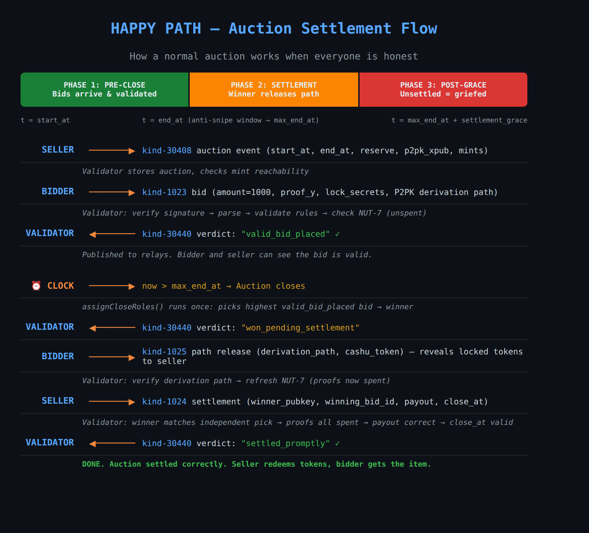
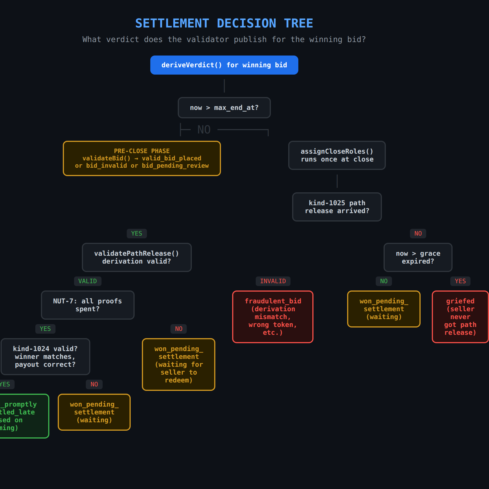
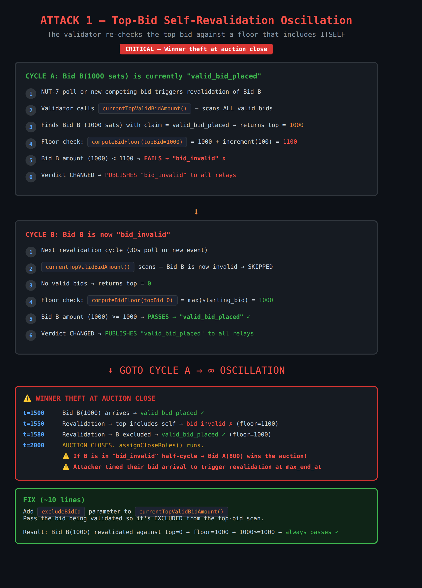

# Bug 1: Top-Bid Self-Revalidation Oscillation

**Severity:** Critical  
**Status:** Under investigation — not a blocker for PR #1170  
**Fix estimate:** ~10 lines  
**Key file:** `src/server/auction-validator/lifecycle.ts` (function `currentTopValidBidAmount`, line ~414)  
**Found:** 2026-07-28 adversarial analysis of `feat/1151-auction-validation` (head `215640d3`)

## Summary

When the validator revalidates the current top bid, it computes the minimum
acceptable bid amount using ALL valid bids in the auction — **including the bid
being checked**. This creates a self-referential floor check that the top bid
can never pass, causing the verdict to oscillate between `valid_bid_placed` and
`bid_invalid` on every revalidation cycle.

## Root Cause

`currentTopValidBidAmount()` scans every bid with `currentClaim === 'valid_bid_placed'`:

```ts
export const currentTopValidBidAmount = (auctionState: ValidatorAuctionState): number => {
	let top = 0
	for (const bidState of Array.from(auctionState.bids.values())) {
		if (bidState.currentClaim !== 'valid_bid_placed') continue
		if (bidState.bid.amount > top) top = bidState.bid.amount
	}
	return top
}
```

This value is passed to `validateBid()` → `computeBidFloor()` as `currentTopBid`:

```ts
const minRequired = computeBidFloor({ auction, topBid: currentTopBid, atSeconds: effectiveT })
```

`computeBidFloor` calculates: `baseline = topBid + bidIncrement` when `topBid > 0`.

When the top bid is being revalidated, `currentTopBid` includes its own amount,
so the floor becomes `self_amount + increment`, which the bid can never satisfy.

## Context: Happy Path Settlement Flow



The diagram above shows how a normal auction settlement works when all parties
are honest. The oscillation bug occurs during the "valid_bid_placed" phase,
before auction close.

## Settlement Decision Tree



The oscillation affects the top-left branch: `validateBid()` →
`valid_bid_placed` vs `bid_invalid`. The self-referential floor check causes
the bid to flip between these two states on every cycle.

---

## The Oscillation Cycle

```
CYCLE A: Bid B(1000 sats) is "valid_bid_placed"
  1. Revalidation triggered (NUT-7 poll, new bid, kind-1024 arrival)
  2. currentTopValidBidAmount() → returns 1000 (includes B)
  3. computeBidFloor(topBid=1000) → 1000 + 100 = 1100
  4. 1000 < 1100 → FAILS → verdict flips to "bid_invalid"
  5. Publisher detects change → publishes "bid_invalid"

CYCLE B: Bid B is now "bid_invalid"
  1. Next revalidation cycle
  2. currentTopValidBidAmount() → B is invalid → returns 0
  3. computeBidFloor(topBid=0) → max(starting_bid) = 1000
  4. 1000 >= 1000 → PASSES → verdict flips to "valid_bid_placed"
  5. Publisher detects change → publishes "valid_bid_placed"

  → GOTO CYCLE A → infinite oscillation
```

## Exploitable Impact

### Visual: How the oscillation enables winner theft



The diagram shows the two oscillation cycles (A: bid fails self-comparison,
B: bid passes when excluded from top), the timeline of winner theft at auction
close, and the proposed fix.

### 1. Spurious verdict churn

Alternating `valid_bid_placed` / `bid_invalid` events published for the
legitimate top bid. This pollutes relays with contradictory verdicts and
confuses clients.

### 2. Winner theft at auction close (critical)

`pickWinningBid()` only considers bids with `currentClaim === 'valid_bid_placed'`.
`assignCloseRoles()` runs once (gated on `closeHandled`) when `now > maxEndAt`.

If the top bid is in its `bid_invalid` half-cycle at the exact moment
`assignCloseRoles()` runs (triggered inside `publishIfChanged()` in
`publisher.ts`), it is **excluded from the candidate set** and a lower bid
wins the auction.

An attacker who can time a triggering event (publishing a competing bid, relying
on a NUT-7 fluctuation) to land on the `bid_invalid` half-cycle right at
`maxEndAt` steals the auction.

### Trigger paths that exercise the bug

- `nut7Poller.ts:159` — republishes with `currentTopValidBidAmount(auctionState)`
  on every NUT-7 state change
- `subscriber.ts` — new bid arrival triggers revalidation of existing bids
- `subscriber.ts` — kind-1024 settlement arrival triggers `republishAuction`

## Why PR #1170 Makes It Worse

- #1170 adds `assignCloseRoles()` and wires it into `publishIfChanged()` — this
  is what makes the oscillation exploitable at auction close (winner
  determination depends on the oscillation cycle).
- #1170 adds NUT-7 polling that triggers more revalidation cycles, increasing
  the frequency of oscillation.
- #1170 adds the close-role publisher that calls `currentTopValidBidAmount()`
  on every publish attempt.

## Recommended Fix

Add an `excludeBidId` parameter to `currentTopValidBidAmount()` and pass the bid
being validated at all call sites:

```ts
export const currentTopValidBidAmount = (auctionState: ValidatorAuctionState, excludeBidId?: string): number => {
	let top = 0
	for (const bidState of Array.from(auctionState.bids.values())) {
		if (bidState.bid.id === excludeBidId) continue // <-- the fix
		if (bidState.currentClaim !== 'valid_bid_placed') continue
		if (bidState.bid.amount > top) top = bidState.bid.amount
	}
	return top
}
```

Call sites that need updating (pass `bidState.bid.id`):

1. `publisher.ts` — `publishIfChanged()`
2. `subscriber.ts` — `onBidEvent()` / revalidation paths
3. `nut7Poller.ts` — `tick()` / `refreshBidChain()`

**Alternative approach:** The floor check in `validateBid` should only apply
the `topBid + increment` branch when the bid is genuinely new (no prior verdict,
or a fresh `prevBidId` leg), not on every revalidation of an already-valid top
bid.

## Test Coverage Gap

No test currently exercises revalidation of the sole top bid. A regression test
should:

1. Insert a single valid bid (amount=1000, starting_bid=1000, increment=100)
2. Trigger a revalidation cycle (simulate NUT-7 poll or republish)
3. Assert the verdict remains `valid_bid_placed` (does not oscillate)
4. Assert no verdict change was published
